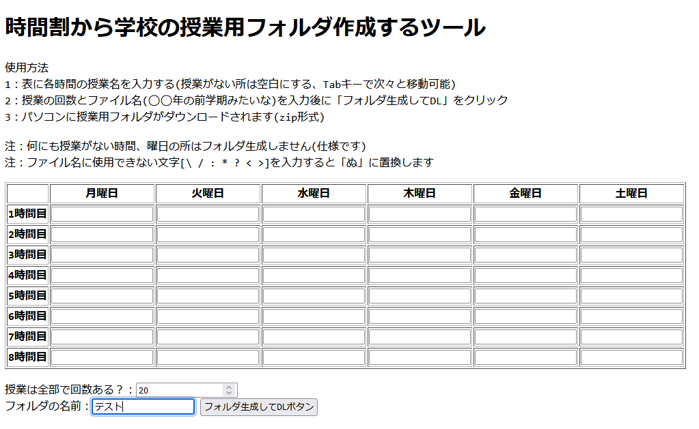

# アプリの概要 
・時間割から学校の授業用フォルダを作成するツールです。  
・「各曜日＞各授業＞各回」という感じのフォルダを生成します。  
・日本の高校か大学向けを想定して作成しました。  

  
# 動作について
・ファイルを右上の「Code＞Download ZIP」でDLして、中にあるhtmlをブラウザで開くだけで使用可能です。  
・JavaScriptしか使用していないので、ランタイム等は不要なはずです。  
・ライブラリはCDNから読み込んでいるので、オフラインでは使用不可です。
  
# 使用しているJavaScriptのライブラリ
これらのライブラリを使用しています。    

## JSZip.js(https://github.com/Stuk/jszip)
Copyright (c) 2009-2016 Stuart Knightley, David Duponchel, Franz Buchinger, António Afonso.
  
  
## FileSaver.js(https://github.com/eligrey/FileSaver.js)  
Copyright © 2016 Eli Grey.
  
# ライセンス
・[MIT license](https://en.wikipedia.org/wiki/MIT_License)です。
